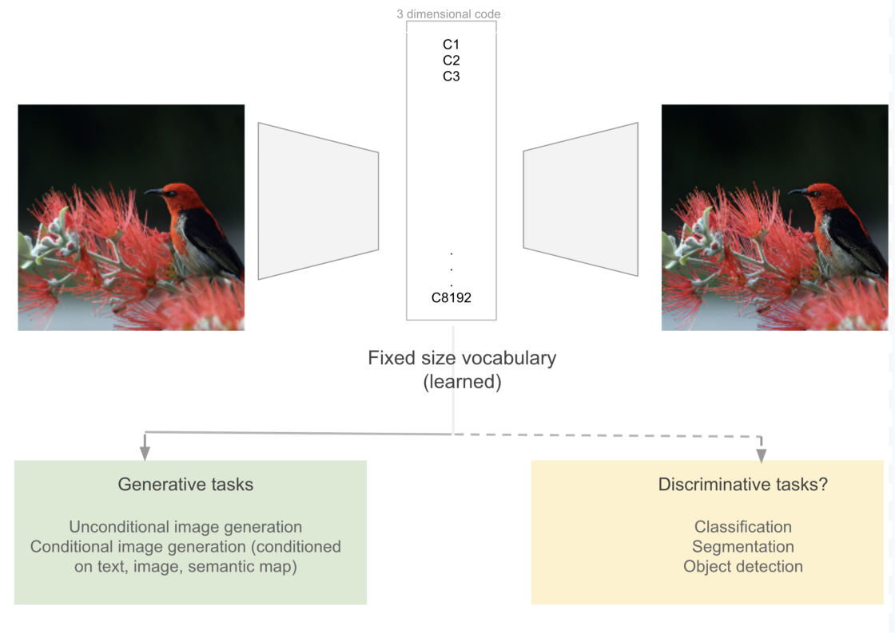
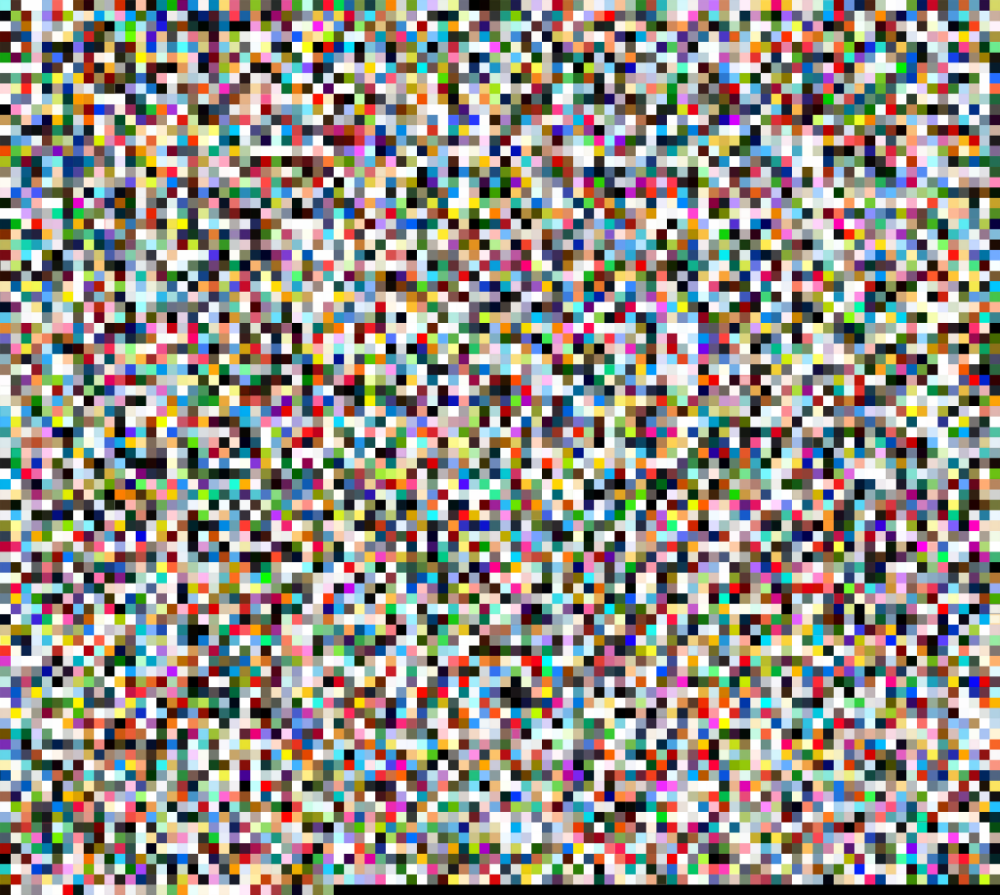

# codebook_comparisons
_Comparison of codebook vectors of autoencoders (DALLE's dVAE vs VQGAN) that map any image to a fixed vocabulary of vectors_
 
 
[Almost Any Image Is Only 8k Vectors. _Post describing the comparison_](https://towardsdatascience.com/almost-any-image-is-only-8k-vectors-c68c1b1aa6d2)
 
 
 
 
 
 
 
 
 

  
  
 _Visualization of DALL-E codebook_
 
 
  
  
  
  
 
   
  
 _Visualization of VQGAN codebook_
